# MusePilot 🎵

**AI-Powered Music Generation Platform**

MusePilot is a comprehensive web-based music creation platform that combines AI-powered music generation, MIDI editing, lyrics generation, and real-time audio synthesis. Built with Next.js 14, TypeScript, and modern web technologies.

---

## 📋 Table of Contents

- [Features](#-features)
- [Architecture](#-architecture)
- [Tech Stack](#-tech-stack)
- [Prerequisites](#-prerequisites)
- [Installation](#-installation)
- [Configuration](#-configuration)
- [Usage](#-usage)
- [API Documentation](#-api-documentation)
- [Project Structure](#-project-structure)
- [Development](#-development)
- [Deployment](#-deployment)
- [Troubleshooting](#-troubleshooting)
- [Contributing](#-contributing)
- [License](#-license)

---

## ✨ Features

### 🎹 Music Creation Tools

- **Piano Roll Editor**: Full-featured MIDI editor with real-time playback
  - Create, edit, and delete notes
  - Loop regions and playback controls
  - Tempo and time signature control
  - Keyboard shortcuts (Space, Delete)

- **AI Music Generation**: Multiple generation methods
  - **Text-to-Music**: Generate music from text descriptions
  - **Melody-to-Music**: Transform humming/melodies into full arrangements
  - **Humming-to-MIDI**: Convert vocal humming to MIDI notes

- **Lyrics Editor**: AI-powered lyrics generation
  - Context-aware generation using Google Gemini
  - Structured output with verse/chorus tags
  - Word/line/character counting

- **AI Co-Pilot**: Conversational music production assistant
  - Real-time chat interface
  - Session context awareness
  - Music production advice and tips

- **Mixer**: Professional audio mixing interface
  - Volume and pan controls per track
  - Mute/Solo functionality
  - Master output control

### 🔐 User Management

- **Firebase Authentication**
  - Email/password sign-in
  - Google OAuth integration
  - Session persistence
  - User profile management

- **Song Management**
  - Create and organize multiple songs
  - Save metadata (genre, mood, tempo, key)
  - Version tracking
  - Audio file storage
  - Chat history persistence

### 🎨 User Interface

- **Modern Design**: Clean, dark-themed interface
- **Responsive Layout**: Works on desktop and tablet
- **Real-time Updates**: Live audio visualization
- **Keyboard Shortcuts**: Efficient workflow

---

## 🏗️ Architecture

### System Overview

```mermaid
graph TB
    subgraph "Frontend - Next.js 14"
        UI[User Interface]
        PR[Piano Roll Editor]
        LE[Lyrics Editor]
        TM[Text-to-Music]
        HM[Humming-to-Music]
        MX[Mixer]
        AI[AI Co-Pilot]
    end
    
    subgraph "State Management"
        ZS[Zustand Store]
        LS[Local Storage]
        FC[Firebase Context]
    end
    
    subgraph "Backend Services"
        NA[Next.js API Routes]
        FS[Firebase Services]
        MS[MusicGen Server]
        HS[Humming Server]
    end
    
    subgraph "External APIs"
        GM[Google Gemini API]
        RP[Replicate API]
        HF[HuggingFace API]
    end
    
    subgraph "Audio Engine"
        TJ[Tone.js]
        WA[Web Audio API]
    end
    
    subgraph "Storage"
        FD[(Firestore DB)]
        FST[(Firebase Storage)]
    end
    
    UI --> PR
    UI --> LE
    UI --> TM
    UI --> HM
    UI --> MX
    UI --> AI
    
    PR --> ZS
    LE --> ZS
    TM --> ZS
    HM --> ZS
    MX --> ZS
    AI --> ZS
    
    ZS --> LS
    ZS --> FC
    
    FC --> FS
    FS --> FD
    FS --> FST
    
    TM --> NA
    HM --> NA
    LE --> NA
    AI --> NA
    
    NA --> GM
    NA --> RP
    NA --> HF
    NA --> MS
    NA --> HS
    
    PR --> TJ
    TJ --> WA
    WA --> Speaker[🔊 Audio Output]
    
    MS --> GPU[GPU Processing]
    HS --> CPU[CPU Processing]
```



### Data Flow


---

## 🛠️ Tech Stack

### Frontend
- **Framework**: Next.js 14 (App Router)
- **Language**: TypeScript
- **Styling**: TailwindCSS
- **UI Components**: Custom components with Radix UI primitives
- **State Management**: Zustand
- **Audio Engine**: Tone.js
- **Icons**: Lucide React

### Backend
- **API**: Next.js API Routes
- **Python Servers**: FastAPI (for MusicGen and Humming)
- **Authentication**: Firebase Auth
- **Database**: Firestore
- **Storage**: Firebase Storage

### AI/ML Services
- **Text Generation**: Google Gemini API
- **Music Generation**: 
  - Replicate (MusicGen)
  - HuggingFace (MusicGen)
  - Local MusicGen Server
- **Pitch Detection**: CREPE
- **Audio Processing**: Librosa, SciPy

### Development Tools
- **Package Manager**: npm
- **Linting**: ESLint
- **Type Checking**: TypeScript

---

## 📦 Prerequisites

### Required
- **Node.js**: v18.0.0 or higher
- **npm**: v9.0.0 or higher
- **Python**: 3.9 or higher (for backend servers)
- **pip**: Python package manager

### Optional (for local music generation)
- **CUDA-capable GPU**: For faster MusicGen processing
- **FFmpeg**: For audio format conversion
- **FluidSynth**: For MIDI-to-audio synthesis

---

## 🚀 Installation

### 1. Clone the Repository

```bash
git clone https://github.com/yourusername/musepilot.git
cd musepilot
```

### 2. Install Frontend Dependencies

```bash
npm install
```

### 3. Install Python Dependencies (Optional)

For local music generation and humming features:

```bash
# Create virtual environment
python -m venv venv

# Activate virtual environment
# Windows:
venv\Scripts\activate
# macOS/Linux:
source venv/bin/activate

# Install dependencies
pip install -r requirements.txt
```

### 4. Set Up Environment Variables

```bash
cp .env.example .env.local
```

Edit `.env.local` with your API keys and configuration (see [Configuration](#-configuration)).

---

## ⚙️ Configuration

### Environment Variables

Create a `.env.local` file in the project root with the following variables:

```env
# ============================================
# AI API Keys
# ============================================

# Google Gemini API (for lyrics and AI chat)
# Get your key: https://makersuite.google.com/app/apikey
GEMINI_API_KEY=your_gemini_api_key_here

# Replicate API (for text-to-music generation)
# Get your key: https://replicate.com/account/api-tokens
# Free $5 credit, ~$0.01 per 10 seconds
REPLICATE_API_TOKEN=r8_your_replicate_token_here

# HuggingFace API (alternative for music generation)
# Get your key: https://huggingface.co/settings/tokens
HUGGINGFACE_API_KEY=your_huggingface_api_key_here

# ============================================
# Backend Server URLs
# ============================================

# MusicGen Server (choose one option)
# Option 1: Google Colab (GPU) - Run musicgen_colab_server_v2.ipynb
# Option 2: Local server - Run: python musicgen_server.py
MUSICGEN_SERVER_URL=https://your-ngrok-url.ngrok-free.app
# or
# MUSICGEN_SERVER_URL=http://localhost:8000

# Humming-to-Music Server (local only)
HUMMING_SERVER_URL=http://localhost:8001

# ============================================
# Firebase Configuration
# ============================================

# Get these from Firebase Console > Project Settings
NEXT_PUBLIC_FIREBASE_API_KEY=your_firebase_api_key
NEXT_PUBLIC_FIREBASE_AUTH_DOMAIN=your_project_id.firebaseapp.com
NEXT_PUBLIC_FIREBASE_PROJECT_ID=your_project_id
NEXT_PUBLIC_FIREBASE_STORAGE_BUCKET=your_project_id.firebasestorage.app
NEXT_PUBLIC_FIREBASE_MESSAGING_SENDER_ID=your_messaging_sender_id
NEXT_PUBLIC_FIREBASE_APP_ID=your_app_id
NEXT_PUBLIC_FIREBASE_MEASUREMENT_ID=your_measurement_id

# ============================================
# Development Options
# ============================================

# Set to 'true' to use mock audio generation (for testing)
# USE_MOCK_AUDIO=false
```

### Firebase Setup

1. **Create Firebase Project**
   - Go to [Firebase Console](https://console.firebase.google.com/)
   - Click "Add project"
   - Follow the setup wizard

2. **Enable Authentication**
   - Navigate to Authentication > Sign-in method
   - Enable "Email/Password"
   - Enable "Google" (optional)

3. **Create Firestore Database**
   - Navigate to Firestore Database
   - Click "Create database"
   - Start in production mode
   - Choose a location

4. **Set Up Storage**
   - Navigate to Storage
   - Click "Get started"
   - Start in production mode

5. **Configure Security Rules**

   See `FIRESTORE_RULES.md` for detailed security rules. Quick setup:

   **Firestore Rules:**
   ```javascript
   rules_version = '2';
   service cloud.firestore {
     match /databases/{database}/documents {
       match /songs/{songId} {
         allow read, write: if request.auth != null && 
                              request.auth.uid == resource.data.user_id;
         allow create: if request.auth != null && 
                         request.auth.uid == request.resource.data.user_id;
       }
     }
   }
   ```

   **Storage Rules:**
   ```javascript
   rules_version = '2';
   service firebase.storage {
     match /b/{bucket}/o {
       match /audio/{userId}/{allPaths=**} {
         allow read, write: if request.auth != null && 
                              request.auth.uid == userId;
       }
     }
   }
   ```

6. **Create Firestore Index**
   - Navigate to Firestore > Indexes
   - Create composite index:
     - Collection: `songs`
     - Fields: `user_id` (Ascending), `last_updated` (Descending)

---

## 🎮 Usage

### Starting the Application

#### Development Mode

```bash
# Start Next.js development server
npm run dev
```

Open [http://localhost:3000](http://localhost:3000) in your browser.

#### Production Mode

```bash
# Build the application
npm run build

# Start production server
npm start
```

### Starting Backend Servers (Optional)

#### MusicGen Server (Local)

```bash
# Activate virtual environment
source venv/bin/activate  # or venv\Scripts\activate on Windows

# Start server
python musicgen_server.py
```

Server runs on `http://localhost:8000`

#### Humming Server

```bash
# Activate virtual environment
source venv/bin/activate

# Start server
cd backend
python humming_server.py
```

Server runs on `http://localhost:8001`

### User Workflow


### Feature Guides

#### 1. Creating a New Song

1. Click "New Song" button
2. Fill in song details:
   - **Title** (required)
   - **Genre** (e.g., Pop, Rock, Jazz)
   - **Mood** (e.g., Happy, Melancholic)
   - **Tempo** (BPM)
   - **Key** (e.g., C Major, A Minor)
   - **Style** (e.g., Acoustic, Electronic)
   - **Instruments** (e.g., Piano, Guitar)
   - **Notes** (optional description)
3. Click "Create Song"
4. You'll be redirected to the song workspace

#### 2. Generating Music from Text

1. Open the "Text-to-Music" panel
2. Enter a description (e.g., "upbeat electronic dance music with synth bass")
3. Adjust duration (5-20 seconds)
4. Click "Generate Music"
5. Wait for generation (10-30 seconds)
6. Play the generated audio
7. Audio is automatically saved to your song

**Sample Prompts:**
- "lo-fi hip hop beat with piano and vinyl crackle"
- "epic cinematic orchestral music with strings"
- "upbeat pop song with catchy melody"
- "ambient electronic soundscape"

#### 3. Converting Humming to Music

1. Open the "Humming-to-Music" panel
2. Click "Start Recording"
3. Hum your melody (5-15 seconds)
4. Click "Stop Recording"
5. Click "Extract Melody Only" to see MIDI notes
6. Or click "Generate Full Music" for accompaniment
7. Notes appear on the piano roll
8. Generated audio plays automatically

**Tips for Best Results:**
- Hum clearly and steadily
- Use a quiet environment
- Hum at a comfortable pitch
- Keep melodies simple and distinct

#### 4. Generating Lyrics

1. Open the "Lyrics Editor" panel
2. Click "Generate with AI"
3. Optionally provide:
   - Song title
   - Artist name
   - Theme or mood
4. Click "Generate"
5. Edit the generated lyrics
6. Lyrics are automatically saved

#### 5. Using the Piano Roll

**Adding Notes:**
- Click on the grid to add a note
- Drag to adjust duration
- Drag vertically to change pitch

**Editing Notes:**
- Click and drag to move notes
- Drag edges to resize
- Click to select, press Delete to remove

**Playback:**
- Press Space to play/pause
- Click "Stop" to reset playhead
- Enable "Loop" for loop region playback

**Keyboard Shortcuts:**
- `Space`: Play/Pause
- `Delete`: Delete selected note
- `Ctrl+Z`: Undo (coming soon)

#### 6. Mixing Tracks

1. Open the "Mixer" panel
2. Adjust volume sliders for each track
3. Pan tracks left/right
4. Use Mute/Solo buttons
5. Adjust master output volume

#### 7. AI Co-Pilot Chat

1. Open the "AI Co-Pilot" panel
2. Type your question or request
3. Press Enter or click Send
4. AI responds with context-aware advice
5. Chat history is saved to your song

**Example Questions:**
- "How can I make this melody more interesting?"
- "What chord progression works well for pop music?"
- "Suggest instruments for an upbeat track"
- "How do I structure a verse-chorus song?"

---

## 📡 API Documentation

### Next.js API Routes

#### POST `/api/gemini`

Generate text using Google Gemini API.

**Request:**
```json
{
  "prompt": "Write lyrics for a happy pop song"
}
```

**Response:**
```json
{
  "success": true,
  "text": "Generated lyrics...",
  "response": "Generated lyrics..."
}
```

#### POST `/api/gen/text`

Generate music from text description using Replicate.

**Request:**
```json
{
  "prompt": "upbeat electronic dance music",
  "durationSec": 10,
  "tempo": 120,
  "key": "C"
}
```

**Response:**
```json
{
  "success": true,
  "audioUrl": "https://replicate.delivery/...",
  "duration": 10
}
```

#### POST `/api/generate-music`

Generate music using HuggingFace or local server.

**Request:**
```json
{
  "prompt": "lo-fi hip hop beat",
  "duration": 10,
  "temperature": 0.8
}
```

**Response:**
```json
{
  "success": true,
  "audioUrl": "/audio/generated-xxx.wav"
}
```

#### POST `/api/humming/extract`

Extract MIDI notes from humming audio.

**Request:**
```
Content-Type: multipart/form-data

audio_file: <audio file>
confidence_threshold: 0.5
min_note_duration: 0.1
```

**Response:**
```json
{
  "success": true,
  "notes": [
    {
      "start": 0.0,
      "end": 0.5,
      "pitch": 60,
      "note_name": "C4",
      "duration": 0.5
    }
  ],
  "midi_url": "/download/melody_xxx.mid"
}
```

#### POST `/api/humming/complete`

Complete humming-to-music pipeline with accompaniment.

**Request:**
```
Content-Type: multipart/form-data

audio_file: <audio file>
add_accompaniment: true
progression_type: "pop"
bass_pattern: "root"
```

**Response:**
```json
{
  "success": true,
  "notes": [...],
  "midi_url": "/download/music_xxx.mid",
  "audio_url": "/download/music_xxx.wav"
}
```

### Python Backend APIs

#### MusicGen Server (Port 8000)

**POST `/generate`**
```json
{
  "prompt": "epic orchestral music",
  "duration": 10.0
}
```

**POST `/generate-from-melody`**
```
Content-Type: multipart/form-data

audio_file: <audio file>
prompt: "add drums and bass"
duration: 10.0
```

#### Humming Server (Port 8001)

**POST `/extract-melody`**
```
Content-Type: multipart/form-data

audio_file: <audio file>
confidence_threshold: 0.5
min_note_duration: 0.1
smooth_window: 5
```

**POST `/humming-to-music`**
```
Content-Type: multipart/form-data

audio_file: <audio file>
add_accompaniment: true
progression_type: "pop"
bass_pattern: "root"
```

---

## 📁 Project Structure

```
musepilot/
├── app/                          # Next.js App Router
│   ├── api/                      # API Routes
│   │   ├── gemini/              # Gemini AI endpoints
│   │   ├── gen/                 # Music generation endpoints
│   │   ├── generate-music/      # HuggingFace music gen
│   │   ├── generate-music-local/# Local music gen
│   │   └── humming/             # Humming-to-music endpoints
│   ├── login/                   # Login page
│   ├── songs/                   # Songs dashboard
│   ├── globals.css              # Global styles
│   ├── layout.tsx               # Root layout
│   └── page.tsx                 # Home page
│
├── components/                   # React Components
│   ├── auth/                    # Authentication components
│   ├── AICopilot.tsx           # AI chat interface
│   ├── HummingToMusicPanel.tsx # Humming feature
│   ├── LoopRegion.tsx          # Piano roll loop region
│   ├── LyricsEditor.tsx        # Lyrics editor
│   ├── MainLayout.tsx          # Main app layout
│   ├── MelodyToMusicPanel.tsx  # Melody generation
│   ├── Mixer.tsx               # Audio mixer
│   ├── NewSongDialog.tsx       # Create song dialog
│   ├── Note.tsx                # Piano roll note
│   ├── PianoKey.tsx            # Piano key component
│   ├── PianoRollGrid.tsx       # Piano roll editor
│   ├── PlaybackControls.tsx    # Audio controls
│   ├── Playhead.tsx            # Playback position
│   ├── shader-background.tsx   # Animated background
│   └── TextToMusicPanel.tsx    # Text-to-music UI
│
├── lib/                         # Utilities and Services
│   ├── auth/                   # Authentication
│   │   ├── AuthContext.tsx    # Auth context provider
│   │   └── authService.ts     # Auth service
│   ├── context/               # React contexts
│   │   └── SongContext.tsx   # Song state context
│   ├── firebase/              # Firebase integration
│   │   ├── config.ts         # Firebase config
│   │   └── songService.ts    # Song CRUD operations
│   ├── hooks/                # Custom React hooks
│   │   └── useSong.ts       # Song management hook
│   └── utils.ts             # Utility functions
│
├── backend/                    # Python Backend Servers
│   ├── humming_server.py      # FastAPI humming server
│   ├── humming_to_midi.py     # Pitch detection & MIDI
│   ├── accompaniment_generator.py # Chord/bass generation
│   ├── generate_test_audio.py # Test audio generator
│   └── test_pipeline.py       # Pipeline tests
│
├── public/                     # Static Assets
│   ├── audio/                 # Generated audio files
│   └── ...                    # Images, icons, etc.
│
├── docs/                       # Documentation
│   └── ...                    # Additional docs
│
├── .env.example               # Environment template
├── .env.local                 # Local environment (gitignored)
├── .gitignore                # Git ignore rules
├── components.json           # shadcn/ui config
├── musicgen_server.py        # MusicGen FastAPI server
├── next.config.js            # Next.js configuration
├── package.json              # Node dependencies
├── requirements.txt          # Python dependencies
├── tailwind.config.ts        # Tailwind configuration
├── tsconfig.json             # TypeScript configuration
└── README.md                 # This file
```

---

## 🔧 Development

### Running in Development Mode

```bash
# Terminal 1: Next.js dev server
npm run dev

# Terminal 2: MusicGen server (optional)
python musicgen_server.py

# Terminal 3: Humming server (optional)
cd backend
python humming_server.py
```

### Code Style

- **TypeScript**: Strict mode enabled
- **ESLint**: Configured for Next.js
- **Formatting**: Follow existing code style
- **Components**: Functional components with hooks
- **State**: Zustand for global state, useState for local

### Adding New Features

1. **Create Component**: Add to `components/`
2. **Add API Route**: Create in `app/api/`
3. **Update State**: Modify Zustand store if needed
4. **Add Types**: Define TypeScript interfaces
5. **Test**: Test all user flows
6. **Document**: Update README and add docs

### Testing

```bash
# Run linter
npm run lint

# Type check
npx tsc --noEmit

# Test API endpoints
curl -X POST http://localhost:3000/api/gemini \
  -H "Content-Type: application/json" \
  -d '{"prompt": "test"}'
```

---

## 🚢 Deployment

### Vercel (Recommended)

1. Push code to GitHub
2. Import project in Vercel
3. Add environment variables
4. Deploy

### Environment Variables for Production

Add all variables from `.env.local` to your deployment platform.

### Backend Servers

For production, you'll need to:

1. **MusicGen Server**: Deploy to cloud with GPU
   - Google Cloud Platform (with GPU)
   - AWS EC2 (with GPU)
   - Use Google Colab with ngrok (temporary)

2. **Humming Server**: Deploy to any cloud platform
   - Vercel (serverless functions)
   - Railway
   - Render
   - Heroku

### Firebase

- Ensure production Firebase project is configured
- Update security rules for production
- Set up billing if needed

---

## 🐛 Troubleshooting

### Common Issues

#### "GEMINI_API_KEY not configured"

**Solution**: Add your Gemini API key to `.env.local`

```bash
GEMINI_API_KEY=your_key_here
```

#### "REPLICATE_API_TOKEN not configured"

**Solution**: Get a free API token from [Replicate](https://replicate.com/account/api-tokens)

#### Music generation takes too long

**Causes**:
- First generation loads the model (30-60 seconds)
- Server is processing other requests
- Network latency

**Solutions**:
- Wait for first generation to complete
- Use local MusicGen server for faster processing
- Reduce duration to 5-10 seconds

#### Humming detection not working

**Causes**:
- Humming server not running
- Low confidence threshold
- Background noise

**Solutions**:
- Start humming server: `python backend/humming_server.py`
- Increase confidence threshold to 0.6-0.7
- Record in quiet environment
- Hum clearly and steadily

#### Firebase authentication errors

**Causes**:
- Firebase not configured
- Invalid credentials
- Security rules not set

**Solutions**:
- Check Firebase config in `.env.local`
- Verify Firebase project is active
- Review security rules in Firebase Console

#### Audio playback issues

**Causes**:
- Browser doesn't support audio format
- Audio file not found
- CORS issues

**Solutions**:
- Use Chrome or Firefox
- Check audio file exists in `/public/audio/`
- Verify CORS settings in backend servers

### Getting Help

1. Check existing documentation in `/docs/`
2. Review error messages in browser console
3. Check server logs for backend errors
4. Search GitHub issues
5. Create a new issue with:
   - Error message
   - Steps to reproduce
   - Environment details

---

## 🤝 Contributing

Contributions are welcome! Please follow these guidelines:

1. **Fork the repository**
2. **Create a feature branch**: `git checkout -b feature/amazing-feature`
3. **Commit changes**: `git commit -m 'Add amazing feature'`
4. **Push to branch**: `git push origin feature/amazing-feature`
5. **Open a Pull Request**

### Development Guidelines

- Follow existing code style
- Add TypeScript types for new code
- Test all features before submitting
- Update documentation for new features
- Write clear commit messages

---

## 📄 License

This project is licensed under the MIT License - see the LICENSE file for details.

---

## 🙏 Acknowledgments

- **Meta AI**: MusicGen model
- **Google**: Gemini API
- **Replicate**: Music generation infrastructure
- **HuggingFace**: Model hosting
- **Tone.js**: Web audio framework
- **Firebase**: Backend services
- **Next.js**: React framework
- **Vercel**: Hosting platform

---

## 📞 Contact

For questions, suggestions, or issues:

- **GitHub Issues**: [Create an issue](https://github.com/yourusername/musepilot/issues)
- **Email**: your.email@example.com
- **Twitter**: @yourusername

---

**Made with ❤️ by the MusePilot Team**

🎵 Happy Music Making! 🎵
